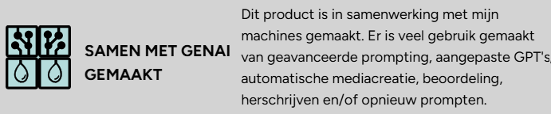

# Chocolate Firm App

In dit project wordt een requirements specificatie opgesteld voor de ontwikkeling van een mobiele applicatie voor Chocolate Firm. De aanleiding voor dit project is de wens van de organisatie om de klantervaring te verbeteren en klantloyaliteit te versterken door middel van een innovatief digitaal platform.

De applicatie dient als een centraal punt waar klanten toegang hebben tot productinformatie, ondersteuning, bestelmogelijkheden en gepersonaliseerde aanbevelingen. Daarnaast biedt de app functionaliteiten zoals productregistratie via QR-codes, een chatbot voor klantvragen, een klachtenmodule en een communityomgeving.

Binnen dit document wordt stap voor stap de context van de organisatie geanalyseerd en vertaald naar concrete eisen voor het systeem. Dit gebeurt aan de hand van een omgevingsanalyse, stakeholderanalyse, bedrijfsprocesanalyse en een productvisie. Vervolgens worden deze inzichten uitgewerkt in user stories, die de basis vormen voor de ontwikkeling van de applicatie.

Tot slot worden de structuur (sitemap) en de belangrijkste schermen (wireframes) van de applicatie weergegeven, zodat duidelijk wordt hoe de functionaliteiten in de praktijk vorm krijgen.

Dit document dient als fundament voor de verdere ontwikkeling van de applicatie en zorgt voor een gedeeld begrip tussen stakeholders en het ontwikkelteam.

## Inhoud
- [Organisatorische Context](docs/01_organisatorische_context.md)
- [Actoren](docs/02_actoren.md)
- [Bedrijfsprocesanalyse](docs/03_bedrijfsprocesanalyse.md)
- [Productvisie](docs/04_productvisie.md)
- [User stories](docs/05_user_stories.md)
- [DoR en DoD](docs/06_dor_dod.md)
- [Sitemap](docs/07_sitemap.md)
- [Wireframes](docs/08_wireframes.md)

