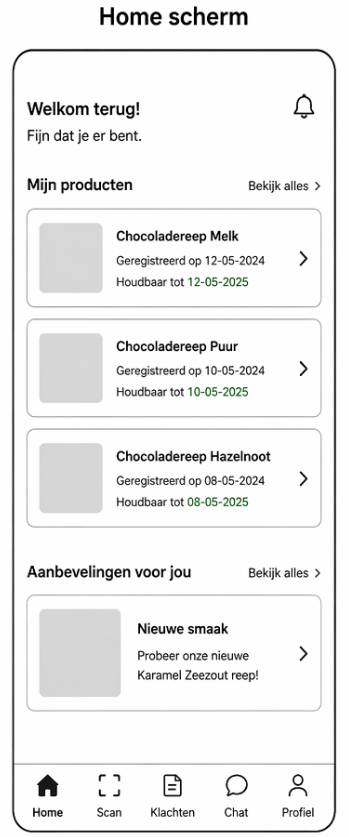
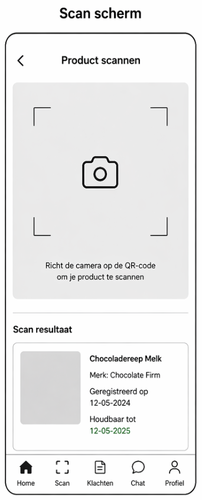
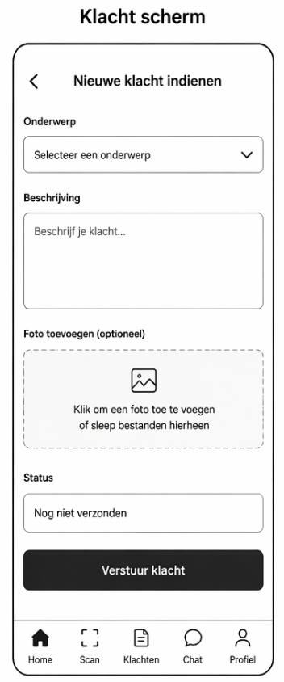
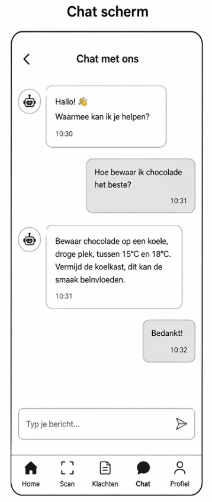

# Wireframes

De onderstaande wireframes visualiseren de belangrijkste schermen van de applicatie.  
Ze zijn gebaseerd op de eerder opgestelde user stories en laten zien hoe de gebruiker met het systeem interacteert.  
---

## Home scherm

### Beschrijving
Het home scherm toont een overzicht van de belangrijkste informatie voor de gebruiker:
- Geregistreerde producten (bijv. chocoladerepen)
- Houdbaarheidsinformatie
- Aanbevelingen voor nieuwe producten

Daarnaast bevat het scherm een vaste navigatiebalk onderin.

### Koppeling met requirements
Dit scherm ondersteunt de requirement dat klanten een centraal overzicht moeten hebben van hun producten en relevante informatie.

### Koppeling met user stories
- Als klant wil ik mijn producten zien zodat ik overzicht heb  
- Als klant wil ik aanbevelingen krijgen zodat ik nieuwe producten ontdek  

---

## Scan scherm

### Beschrijving
Het scan scherm maakt het mogelijk om producten te registreren:
- Cameraweergave voor het scannen van QR-codes
- Scanresultaat met productinformatie
- Informatie zoals naam, merk en houdbaarheid

### Koppeling met requirements
Dit scherm ondersteunt de requirement dat gebruikers producten eenvoudig moeten kunnen registreren via QR-code of invoer.

### Koppeling met user stories
- Als klant wil ik een product scannen zodat ik productinformatie kan zien  

---

## Klacht scherm

### Beschrijving
Het klacht scherm biedt een formulier waarmee gebruikers problemen kunnen melden:
- Onderwerp selecteren
- Beschrijving invoeren
- Foto uploaden
- Status van de klacht bekijken
- Verstuurknop

### Koppeling met requirements
Dit scherm ondersteunt de requirement dat klanten eenvoudig klachten en kwaliteitsproblemen moeten kunnen melden en volgen.

### Koppeling met user stories
- Als klant wil ik een klacht melden zodat mijn probleem opgelost wordt  
- Als klant wil ik de status van mijn klacht zien zodat ik weet wat er gebeurt  

---

## Chat scherm

### Beschrijving
Het chat scherm toont een conversatie tussen gebruiker en chatbot:
- Berichten van gebruiker en systeem
- Inputveld om berichten te typen
- Realtime communicatie

### Koppeling met requirements
Dit scherm ondersteunt de requirement dat klanten 24/7 ondersteuning krijgen via een AI-chatbot.

### Koppeling met user stories
- Als klant wil ik vragen stellen zodat ik snel antwoord krijg  

---
[Vorige](07_sitemap.md) | [README](../README.md)
