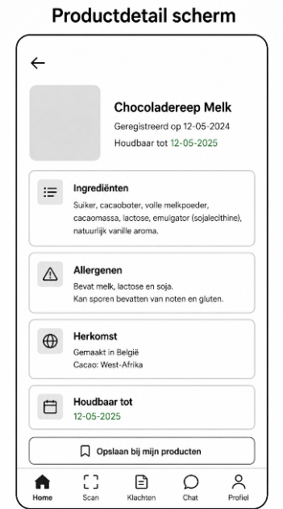
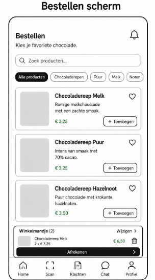
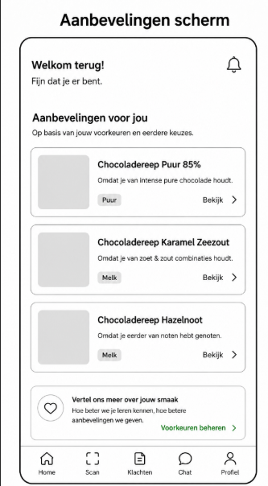
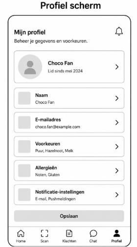
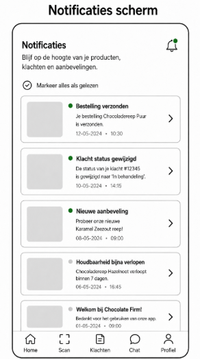

# Wireframes

De onderstaande wireframes visualiseren de belangrijkste schermen van de applicatie.  
Ze zijn gebaseerd op de eerder opgestelde user stories en laten zien hoe de gebruiker met het systeem interacteert.  
---

## Home scherm

### Beschrijving
Het home scherm toont een overzicht van de belangrijkste informatie voor de gebruiker: 

Geregistreerde producten, zoals chocoladerepen 
Houdbaarheidsinformatie per product 
Aanbevelingen voor nieuwe producten 
Recente meldingen of updates 
Daarnaast bevat het scherm een vaste navigatiebalk onderin, waarmee de gebruiker snel kan navigeren naar Home, Scan, Klachten, Chat en Profiel. 

### Koppeling met requirements
Dit scherm ondersteunt de requirement dat klanten een centraal overzicht moeten hebben van hun producten, relevante productinformatie en persoonlijke aanbevelingen.

### Koppeling met user stories
Als klant wil ik een overzicht van mijn geregistreerde chocoladeproducten bekijken, zodat ik inzicht heb in mijn producten, houdbaarheid en relevante productinformatie. 
Als klant wil ik gepersonaliseerde productaanbevelingen ontvangen, zodat ik nieuwe chocoladeproducten ontdek die passen bij mijn voorkeuren en aankoopgedrag. 
Als klant wil ik meldingen ontvangen over bestellingen, klachten en relevante productinformatie, zodat ik op tijd op de hoogte ben van belangrijke updates.
---

## Scan scherm

### Beschrijving
Het scan scherm maakt het mogelijk om een QR-code op een chocoladeproduct te scannen. De gebruiker kan hiermee snel productinformatie ophalen zonder handmatig te zoeken. 
Het scherm bevat: 
Een cameraweergave met scanvlak 
Een knop om de scan te starten 
Een optie om een productcode handmatig in te voeren 
Een overzicht van de meest recente scan 

### Koppeling met requirements
Dit scherm ondersteunt de requirement dat klanten producten eenvoudig moeten kunnen registreren en productinformatie kunnen ophalen via een QR-code. 

### Koppeling met user stories
Als klant wil ik een QR-code op een chocoladeproduct scannen, zodat ik direct productinformatie zoals ingrediënten, herkomst, allergenen en houdbaarheid kan bekijken. 

---
---

## Productdetail scherm

### Beschrijving

Het productdetail scherm toont uitgebreide informatie over een gescand of geselecteerd chocoladeproduct.

Het scherm bevat:

- Productnaam en productafbeelding  
- Registratiedatum  
- Houdbaarheidsdatum  
- Ingrediënten  
- Allergenen  
- Herkomstinformatie  
- Knop om het product op te slaan bij **“Mijn producten”**

### Koppeling met requirements

Dit scherm ondersteunt de requirement dat klanten volledige en betrouwbare productinformatie moeten kunnen bekijken na het scannen of openen van een product.

### Koppeling met user stories

Als klant wil ik een QR-code op een chocoladeproduct scannen, zodat ik direct productinformatie zoals ingrediënten, herkomst, allergenen en houdbaarheid kan bekijken.

Als klant wil ik een overzicht van mijn geregistreerde chocoladeproducten bekijken, zodat ik inzicht heb in mijn producten, houdbaarheid en relevante productinformatie.
## Klacht scherm

### Beschrijving
Het klachten scherm geeft de gebruiker de mogelijkheid om een klacht of kwaliteitsprobleem in te dienen en bestaande klachten te volgen. 
Het scherm bevat: 
Formulier voor het indienen van een klacht 
Onderwerpveld 
Categoriekeuze 
Beschrijving van de klacht 
Mogelijkheid om een foto toe te voegen 
Overzicht van eerder ingediende klachten 
Status van klachten, zoals “In behandeling” of “Opgelost” 

### Koppeling met requirements
Dit scherm ondersteunt de requirement dat klanten klachten eenvoudig digitaal kunnen melden en de voortgang van hun klacht kunnen volgen. 

### Koppeling met user stories
Als klant wil ik een klacht of kwaliteitsprobleem kunnen indienen, zodat Chocolate Firm mijn probleem kan beoordelen en oplossen. 
Als klant wil ik de status van mijn ingediende klacht kunnen volgen, zodat ik weet wat er met mijn melding gebeurt. 
---

## Chat scherm

### Beschrijving
Het chat scherm biedt ondersteuning via een AI-chatbot. De gebruiker kan vragen stellen over producten, bestellingen, klachten en accountinformatie. 
Het scherm bevat: 
Gespreksvenster met berichten van de klant en chatbot 
Automatische antwoorden van de chatbot 
Invoerveld om vragen te typen 
Verzendknop 
Mogelijkheid om snel hulp te krijgen zonder te wachten op een medewerker 
### Koppeling met requirements
Dit scherm ondersteunt de requirement dat klanten snel ondersteuning moeten kunnen krijgen via een digitale self-service oplossing. 

### Koppeling met user stories
Als klant wil ik vragen kunnen stellen aan een AI-chatbot, zodat ik snel antwoord krijg zonder te wachten op een klantenservicemedewerker. 
---

## Bestellen scherm

### Beschrijving

Het bestellen scherm maakt het mogelijk om chocoladeproducten te zoeken, bekijken en bestellen via de app.

Het scherm bevat:

- Zoekbalk voor producten  
- Productcategorieën  
- Productkaarten met naam, beschrijving en prijs  
- Knop om producten toe te voegen aan het winkelmandje  
- Winkelmandje met geselecteerde producten  
- Betaal- of afrekenknop  

### Koppeling met requirements

Dit scherm ondersteunt de requirement dat klanten producten direct via de app moeten kunnen bestellen zonder gebruik te maken van een extern kanaal.

### Koppeling met user stories

Als klant wil ik chocoladeproducten via de app kunnen bestellen, zodat ik snel en eenvoudig producten kan kopen zonder een extern kanaal te gebruiken.

---

## Aanbevelingen scherm

### Beschrijving

Het aanbevelingen scherm toont persoonlijke productaanbevelingen op basis van voorkeuren, eerdere aankopen of geregistreerde producten.

Het scherm bevat:

- Lijst met aanbevolen producten  
- Korte uitleg waarom een product wordt aanbevolen  
- Productcategorie of smaaklabel  
- Knop om een aanbevolen product te bekijken  
- Mogelijkheid om voorkeuren verder te beheren  

### Koppeling met requirements

Dit scherm ondersteunt de requirement dat klanten gepersonaliseerde aanbevelingen moeten kunnen ontvangen op basis van voorkeuren en klantgedrag.

### Koppeling met user stories

Als klant wil ik gepersonaliseerde productaanbevelingen ontvangen, zodat ik nieuwe chocoladeproducten ontdek die passen bij mijn voorkeuren en aankoopgedrag.

---

## Profiel scherm

### Beschrijving

Het profiel scherm geeft de gebruiker de mogelijkheid om persoonlijke gegevens en voorkeuren te beheren.

Het scherm bevat:

- Profielgegevens van de gebruiker  
- Naam  
- E-mailadres  
- Voorkeuren, zoals favoriete chocoladesoorten  
- Allergieën  
- Notificatie-instellingen  
- Opslaanknop voor wijzigingen  

### Koppeling met requirements

Dit scherm ondersteunt de requirement dat klanten hun accountgegevens, voorkeuren en notificatie-instellingen kunnen beheren binnen de app.

### Koppeling met user stories

Als klant wil ik mijn profielgegevens en voorkeuren kunnen beheren, zodat mijn gegevens actueel blijven en de app beter aansluit op mijn persoonlijke situatie.

---

## Notificaties scherm

### Beschrijving

Het notificaties scherm toont belangrijke meldingen voor de gebruiker. Hierdoor blijft de klant op de hoogte van updates binnen de app.

Het scherm bevat:

- Meldingen over bestellingen  
- Meldingen over klachtstatussen  
- Meldingen over nieuwe aanbevelingen  
- Meldingen over houdbaarheid van producten  
- Mogelijkheid om meldingen als gelezen te markeren  

### Koppeling met requirements

Dit scherm ondersteunt de requirement dat klanten tijdig meldingen moeten ontvangen over bestellingen, klachten, producten en persoonlijke aanbevelingen.

### Koppeling met user stories

Als klant wil ik meldingen ontvangen over bestellingen, klachten en relevante productinformatie, zodat ik op tijd op de hoogte ben van belangrijke updates.
---
[Vorige](07_sitemap.md) | [README](../README.md)
